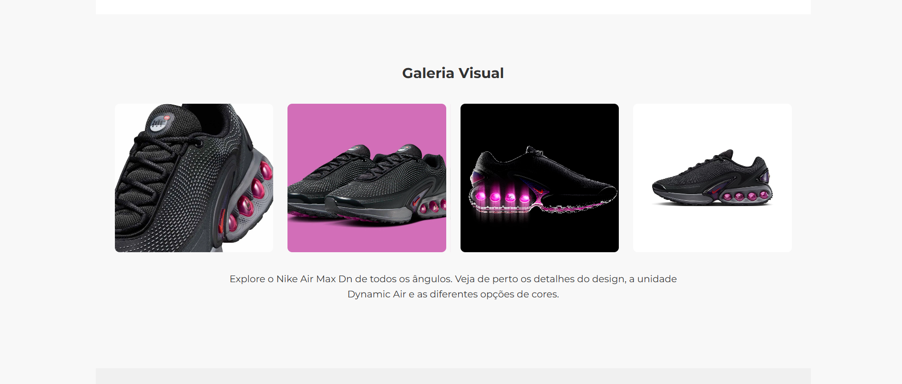

## Air Max Dn
---

## Descrição 🚀

Air Max Dn é uma aplicação web desenvolvida em Flask para um jogo de cartas interativo. O projeto implementa um sistema de deck building onde os jogadores podem escolher personagens, salvar seus decks e participar de partidas.

---

## Técnologias usadas 📱

•Framework: Flask (Python)

• Template Engine: Jinja2

• Configurações: Auto-reload de templates habilitado

• Validação: Verificação de existência de templates

• Persistência: Salvamento de decks em arquivo JSON

---

## Fotos do Projeto

---

